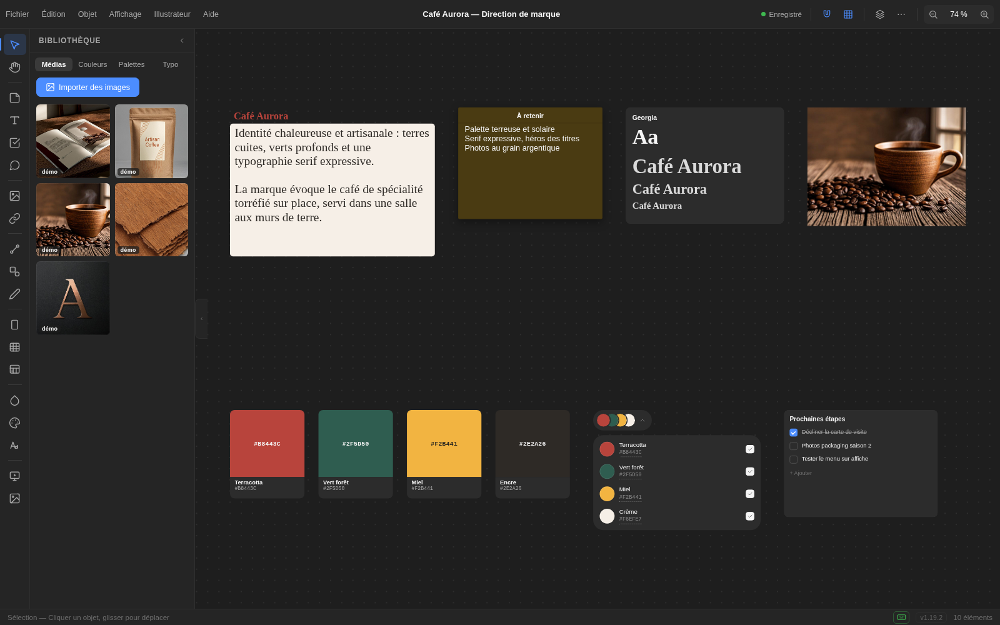

# Moodbord

> **La table de travail spatiale pour designers.** Un canevas infini où l'on
> pose des références, des couleurs, des textes et des notes — puis on
> organise, on zoome sur le détail, on exporte.

Moodbord rassemble moodboards de marque, références, palettes, typographies
et annotations dans un espace libre : **17 types d'éléments**, zoom et
déplacement fluides, annulation illimitée et sauvegarde automatique.

<p align="center">
  
</p>

---

## 🧩 Deux éditions, un seul moteur

| | 🧩 **Extension Illustrator** | 🖥️ **Application autonome** |
|---|---|---|
| Où elle vit | Panneau latéral dans Illustrator | Toute seule, comme une app classique |
| Hôte requis | Illustrator 2021 ou plus récent | Aucun |
| Windows | ✔ | ✔ 10 / 11 (64 bits) |
| macOS | ✔ | ✔ 11 Big Sur et + (Intel + Apple Silicon) |
| Pont Illustrator | ✔ nuances & placement d'images | — (export SVG/PNG à la place) |

Les deux éditions partagent **exactement le même moteur** et les mêmes
fichiers de projets : vos moodboards passent de l'une à l'autre sur une même
machine.

---

## 📥 Installation

Tous les installateurs sont sur la page
**[Releases](https://github.com/E10e04/Moodbord/releases)** — la dernière
version est en tête de liste.

### 🖥️ Application autonome

**Windows**

1. Téléchargez `Moodboard-Setup-<version>.exe`.
2. Lancez-le : l'application s'installe et démarre.
   *Sans installation ni droits administrateur ? Prenez
   `Moodboard-<version>-Windows-x64-portable.zip`, dézippez et lancez
   `Moodboard.exe`.*

**macOS**

1. Téléchargez `Moodboard-<version>-arm64.dmg` (Apple Silicon) ou
   `Moodboard-<version>-x64.dmg` (Intel).
2. Glissez « Moodboard » dans Applications.
3. Premier lancement : **clic droit ▸ Ouvrir** (application non signée —
   voir [À savoir](#-à-savoir)).

### 🧩 Extension Illustrator

1. Téléchargez `moodboard-cep-<version>.zip` depuis le dernier
   [Release](https://github.com/E10e04/Moodbord/releases).
2. Dézippez son contenu dans le dossier des extensions CEP d'Adobe :
   - **macOS** : `~/Library/Application Support/Adobe/CEP/extensions/moodboard-cep/`
   - **Windows** : `%APPDATA%\Adobe\CEP\extensions\moodboard-cep\`

   Le dossier `moodboard-cep` doit contenir `CSXS/` et `client/` à sa racine.
3. Autorisez les extensions non signées (une seule fois) :
   - **macOS** — dans le Terminal :
     ```bash
     defaults write com.adobe.CSXS.11 PlayerDebugMode 1
     defaults write com.adobe.CSXS.10 PlayerDebugMode 1
     ```
   - **Windows** — dans `regedit`, clé
     `HKEY_CURRENT_USER\Software\Adobe\CSXS.11` : valeur chaîne
     `PlayerDebugMode` = `1`
4. Relancez Illustrator → menu **Fenêtres ▸ Extensions ▸ Moodboard**.

---

## ✨ Fonctionnalités

- **Canevas infini** — zoom focalisé sur le curseur, déplacement (Espace +
  glisser, bouton du milieu, outil Main), ajuster à l'écran `⇧1`.
- **17 types d'éléments** — images, textes, notes, couleurs, palettes,
  typographie, liens, flèches, formes, sections, colonnes, tableaux,
  checklists, croquis…
- **Bibliothèque latérale** — vos médias, couleurs, palettes et polices ;
  tout est éditable, import par glisser-déposer multi-fichiers.
- **Outil Preview** — applique l'identité du moodboard (couleurs et polices)
  à un vrai site web, recoloré en direct.
- **Édition confortable** — annuler/rétablir transactionnel, presse-papiers,
  duplication, alignement, dispositions automatiques (grille, masonry).
- **Export** — SVG vectoriel (ouvrable dans Illustrator) et PNG 2×.
- **Sauvegarde automatique** ~800 ms après chaque modification, projets au
  format `.moodboard`.

---

## 💾 Vos données

- **macOS** : `~/Library/Application Support/Moodboard`
- **Windows** : `%APPDATA%\Moodboard`

Elles sont partagées entre l'extension et l'application autonome sur une
même machine ; supprimer ce dossier réinitialise tout.

## ⚠️ À savoir

- Les applications ne sont **pas signées** : Windows (SmartScreen) et macOS
  (Gatekeeper) peuvent demander une confirmation au premier lancement —
  « Plus d'infos ▸ Exécuter quand même » / clic droit ▸ Ouvrir. Une
  signature exige des certificats payants.
- L'extension nécessite l'étape `PlayerDebugMode` ci-dessus : c'est une
  contrainte Adobe pour les extensions non signées, sans risque pour le
  système.

## 📜 Historique des versions

Chaque version et ses nouveautés sont détaillées sur la page
**[Releases](https://github.com/E10e04/Moodbord/releases)**.

## 📄 Licence

Projet Moodbord — usage libre.
